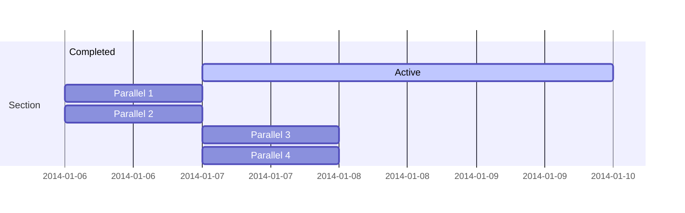

Der [Cyber Resilience Act (CRA)](https://digital-strategy.ec.europa.eu/en/policies/cyber-resilience-act) wurde bereits vom EU Parlement verabschiedet und wird nach formeller Bestätigung des EU Rates höchstwarscheinlich in den nächsten Wochen final beschlossen. Der CRA geht für viele Hersteller von vernetzten Produkten mit strengen Verpflichtungen bezüglich der IT Sicherheit einher und verlangt von diesen erhöhten Aufwand in der Dokumentation.

## Ist mein Produkt betroffen?
Der Cyber Resilience Act (CRA) richtet sich an Hersteller von Produkten mit digitalen Elementen, die in der Europäischen Union in Verkehr gebracht werden. 
Betroffen sind digitale Produkte -- sprich Produkte mit Hardware und/oder Software Komponenten -- welche grundsätzlich eine Kommunikationsschnittstelle (mit Steckverbindung, Kabel oder kabellos) nach Außen haben. Medizinische Produkte, genauso Produkte zum motorisierten Personentransport sind ausgeschlossen, weil diese unter seperaten, eigenständigen Regularien stehen. Beispiele für Produkte, welche unter den neuen CRA fallen, sind: 

- Smart Home Produkte 
- Spielzeug mit Stimmaufnahme und Verarbeitung
- Ferngesteuerte Spielzeuge
- Smarte Hygiene Produkte
- Smarte Audiosysteme
- Industriesteuerung
- Automatisierungsgeräte (z.B. Roboterarme)


## Was passiert bei Nicht-Erfüllung des Cyber Resilience Acts (CRA)? Wie hoch können die Strafen ausfallen?

Die Nichteinhaltung des Cyber Resilience Acts (CRA) kann für Unternehmen schwerwiegende rechtliche und finanzielle Konsequenzen haben. Hier sind die möglichen Folgen und Strafen, die bei einer Nicht-Erfüllung des CRA drohen:

### **Bußgelder**

Die Verordnung sieht erhebliche Geldstrafen für Verstöße vor. Die Höhe der Bußgelder richtet sich nach der Schwere des Verstoßes:

**Schwere Verstöße**: Bei schwerwiegenden Verstößen gegen die zentralen Bestimmungen des CRA, wie z.B. die Missachtung grundlegender Sicherheitsanforderungen oder das Inverkehrbringen von Produkten mit digitalen Elementen ohne angemessene Sicherheitsvorkehrungen, können Bußgelder von bis zu **15 Millionen Euro** oder **2,5 % des weltweiten Jahresumsatzes** des Unternehmens verhängt werden, je nachdem, welcher Betrag höher ist.

**Geringfügigere Verstöße**: Für weniger schwerwiegende Verstöße, wie z.B. das Nichtvorhandensein der erforderlichen technischen Dokumentation oder die nicht ordnungsgemäße Durchführung von Konformitätsbewertungen, können Bußgelder von bis zu **10 Millionen Euro** oder **2 % des weltweiten Jahresumsatzes** verhängt werden, je nachdem, welcher Betrag höher ist.

### **Vertriebsverbot und Produktrückrufe**

**Vertriebsverbot**: Produkte, die nicht den Anforderungen des CRA entsprechen, dürfen nicht in Verkehr gebracht werden. Sollte ein Produkt, das den CRA-Anforderungen nicht entspricht, bereits auf dem Markt sein, kann ein Vertriebsverbot verhängt werden.
  
**Produktrückrufe**: Behörden können anordnen, dass nicht-konforme Produkte zurückgerufen oder vom Markt genommen werden müssen, wenn diese Produkte ein erhebliches Sicherheitsrisiko darstellen.

### **Schadenersatzforderungen**

Unternehmen, die den CRA nicht erfüllen, können zudem mit Schadenersatzforderungen von Nutzern oder anderen betroffenen Parteien konfrontiert werden. Diese Ansprüche könnten sich aus Sicherheitsvorfällen ergeben, die auf eine Nichteinhaltung der Verordnung zurückzuführen sind.

### **Reputationsschaden**

Neben den finanziellen Strafen kann die Nichteinhaltung des CRA zu erheblichen Reputationsschäden führen. Dies kann langfristig negative Auswirkungen auf das Vertrauen der Kunden und Partner sowie die Marktposition des Unternehmens haben.


Die Nichteinhaltung des Cyber Resilience Acts kann zu sehr hohen Bußgeldern, Vertriebsverboten, Produktrückrufen und möglichen Schadenersatzforderungen führen. Unternehmen sollten daher sicherstellen, dass ihre Produkte mit digitalen Elementen den Anforderungen des CRA entsprechen, um rechtliche und finanzielle Risiken zu vermeiden. Da die Regularien Fachwissen bzgl. IT-Sicherheit voraussetzen und die Maßnahmen je nach Produkt sehr umfangreich sein können, empehlen wir Ihnen, sich schon jetzt mit dem CRA auseinanderzusetzen und damit zu beginnen, die Maßnahmen und erforderliche Dokumente umzusetzen. [Falls Sie Hilfe dabei brauchen, helfen wir ihnen dabei gerne.](mailto::securisk-dk@gmail.com). 

 


## Wann tritt der Cyber Resiliance Act in Kraft?

Dass der CRA demnächste in Kraft tritt, ist sicher. Wann dies der Fall sein wird, ist noch nicht abschließend geklärt. Momentan geht man davon aus, dass der EU Rat den CRA in den nächsten Wochen final unterzeichnen wird und er dann in Kraft tritt.

Hersteller haben nach Inkrafttreten 36 Monate Zeit, um die vorgeschriebenen Maßnahmen umzusetzen. Da es sich um Verpflichtungen während des kompletten Produktzyklus handelt und IT-Sicherheit schon während der Entwicklung mit einbezogen werden muss, sollten Herrsteller jedoch baldig beginnen, die Maßnahmen in ihre Prozesse und Produkte zu integrieren. 


## Was sind meine Pflichten?

Der CRA nimmt Hersteller in die Pflicht, Cyber Security während des gesamten Produktzyklus zu betrachten. Die spezifischen Pflichten unterscheiden sich je nach Kategorisierung des Produktes. Hierbei gibt es folgene Hauptkategorisierung:

### Produkte mit digitalen Elementen

Grundlegend müssen für Produkte mit digitalen Elementen die im Anhang I Kapitel 1 definierten Maßnahmen umgesetzt werden. Wir wollen hier einen kurzen Überblick über die wichtigsten Maßnamen geben. 

#### Sicherheitsanforderungen

**Security by Design:** Produkte mit digitalen Elementen werden so konzipiert, entwickelt und ergestellt, dass sie angesichts der Risiken ein angemessenes Sicherheitsniveau gewährleisten.

**Keine bekannten Schwachstellen:** Produkte mit digitalen Elementen werden ohne bekannte ausnutzbare Schwachstellen ausgeliefert.

**Risikobewertung als Teil der Dokumentation:** Auf der Grundlage einer Risikobewertung muss das Risiko bezüglich der Schutziele (Vertraulichkeit, Integrität und Authentizität) minimiert werden, um Sicherheit und Privatsphäre angemessen zu schützen. Hierzu werden konkrete Vorgaben gemacht, wie *Minimalisierung der Datenmengen*, *Monitoring*, und *Einfache Updatebarkeit*. Diese müssen von Herstellern bestrachtet und umgesetzt werden. Diese Risikobewertung muss insbesondere der technischen Dokumentation beigefügt werden.

Wir helfen Ihnen gerne bei der Umsetzung der Sicherheitsanforderungen. 
[Kontaktieren Sie uns einfach und unverbindlich.](mailto::securisk-dk@gmail.com) 

#### Anforderungen an die Behandlung von Schwachstellen

Der CRA verpflichtet Hersteller zu einer umfangreichen Behandlung von identifizierten Schwachstellen: 

**Erkennung und Dokumentation:** Hersteller müssen Schwachstellen und Produktkomponenten identifizieren und dokumentieren, einschließlich einer Software-Stückliste.

**Schnelle Behebung:** Schwachstellen müssen unverzüglich behoben werden, zum Beispiel durch Sicherheitsupdates.

**Regelmäßige Überprüfung:** Die Sicherheit des Produkts muss regelmäßig getestet und überprüft werden.

**Veröffentlichung von Informationen:** Nach einem Update müssen Informationen über die behobenen Schwachstellen veröffentlicht werden.

**Koordinierte Offenlegung:** Es muss eine Strategie zur koordinierten Offenlegung von Schwachstellen geben.

**Sicherer Update-Mechanismus:** Updates müssen sicher verbreitet werden, um Schwachstellen zeitnah zu beheben.

**Kostenlose Bereitstellung von Sicherheits-Patches:** Sicherheits-Patches müssen unverzüglich und kostenlos bereitgestellt werden.


### Kritische Produkte mit digitalen Elementen 
Im CRA ist eine Unterkategorie der Produkte mit digitalen Elementen definiert: *Kritische* Produkte mit digitalen Elementen. Im Anhang III der CRA sind Kernfunktionalitäten aufgelistet. Produkte, welche diese Funktionalitäten beinhalten gehen mit intensiveren Pflichten einher - wobei Klasse II noch einmal umfangreicher gehandhabt werden muss als Klasse I. Dies geht einfach mit einem erhöhten Sicherheitsrisiko dieser Proudukte einher.

#### Klasse I

Klasse I umfasst Produkte, die eine wesentliche Rolle in der Cybersicherheit spielen, aber nicht zu den höchstkritischen Systemen zählen. Dazu gehören unter anderem:

- Software für Identitätsmanagement und Verwaltung privilegierten Zugriffs
- Passwort-Manager
- Firewalls und Angriffserkennungssysteme, die nicht zur Klasse II gehören
- Betriebssysteme, die nicht zur Klasse II gehören
- Router und Modems für die Internetanbindung, die nicht zur Klasse II gehören
- Mikroprozessoren, die nicht zur Klasse II gehören


 

#### Klasse II

Diese Klasse beinhaltet Produkte, die in besonders kritischen Infrastrukturen verwendet werden oder eine sehr hohe Sicherheitsrelevanz haben. Beispiele hierfür sind:

- Betriebssysteme für Server, Desktops und Mobilgeräte
- Firewalls und Angriffserkennungssysteme für den industriellen Einsatz
- Hardware-Sicherheitsmodule (HSM)
- Sichere Kryptoprozessoren
- Industrielle Automatisierungs- und Steuerungssysteme, die für wesentliche Einrichtungen bestimmt sind

*Kritische* Produkte mit digitalen Elementen (Klasse I + II) gehen grundsetzlich mit einer strengeren Konformitätsprüfung einher, d.h. mit einem strengeren Assessment, inwiefern der CRA erfüllt wird. 


## Wie wird mein Produkt überprüft?

Das Konformitätsassessment im Rahmen des Cyber Resilience Acts variiert je nach Art des Produkts und dessen Klassifizierung. Wir geben hier ein Überblick darüber, wie das Verfahren für die drei genannten Kategorien  grob aussieht:

### Produkte mit digitalen Elementen
Für allgemeine Produkte mit digitalen Elementen, die nicht als kritisch eingestuft werden, gibt es in der Regel ein einfacheres Konformitätsbewertungsverfahren (die Module sind in Anhang IV des CRA): 

**Interne Kontrolle (Modul A)**: Der Hersteller übernimmt selbst die Verantwortung für die Einhaltung der grundlegenden Sicherheitsanforderungen. Der Hersteller erstellt die technische Dokumentation, führt interne Tests durch und bringt die CE-Kennzeichnung an. Es ist keine externe Überprüfung durch eine benannte Stelle erforderlich, es sei denn, der Hersteller entscheidet sich freiwillig für eine solche Überprüfung.

### Kritische Produkte mit digitalen Elementen der Klasse I
Für kritische Produkte der Klasse I gelten strengere Anforderungen:

**Interne Kontrolle (Modul A)**: Ähnlich wie bei allgemeinen Produkten können Hersteller die Einhaltung der Anforderungen selbst überprüfen und dokumentieren. Zusätzlich zu Modul A können Hersteller auch eine EU-Baumusterprüfung (Modul B) durch eine benannte Stelle durchführen lassen, wenn sie dies als notwendig erachten. Es wird jedoch erwartet, dass das Produkt eine gründliche Risikobewertung durchläuft und die Konformität mit den relevanten Sicherheitsstandards streng überwacht wird.

**Konformität mit dem Baumuster auf Grundlage interner Fertigungskontrolle (Modul C)**: Nach erfolgreicher EU-Baumusterprüfung muss der Hersteller sicherstellen, dass alle produzierten Einheiten dem geprüften Baumuster entsprechen.

### Kritische Produkte mit digitalen Elementen der Klasse II
Kritische Produkte der Klasse II unterliegen den strengsten Anforderungen, da sie besonders sicherheitsrelevant sind:

**EU-Baumusterprüfung (Modul B)**: Eine benannte Stelle prüft die technische Dokumentation, die Risikobewertung und führt Tests durch, um sicherzustellen, dass das Produkt die Anforderungen erfüllt. Nach bestandener Prüfung wird eine EU-Baumusterprüfbescheinigung ausgestellt.

**Konformität mit dem Baumuster auf Grundlage interner Fertigungskontrolle (Modul C)**: Der Hersteller muss sicherstellen, dass alle produzierten Einheiten dem geprüften Baumuster entsprechen und dies durch entsprechende Dokumentation nachweisen.

**Umfassende Qualitätssicherung (Modul H)**: Für besonders kritische Produkte kann ein umfassendes Qualitätssicherungssystem erforderlich sein. Dieses System wird von einer benannten Stelle überprüft und deckt den gesamten Lebenszyklus des Produkts ab, einschließlich Konzeption, Entwicklung, Herstellung und Schwachstellenmanagement.


<!-- Hugo Blox supports a Markdown extension for mindmaps.

Simply insert a Markdown code block labelled as `markmap` and optionally set the height of the mindmap as shown in the example below.

Mindmaps can be created by simply writing the items as a Markdown list within the `markmap` code block, indenting each item to create as many sub-levels as you need:

<div class="highlight">
<pre class="chroma">
<code>
```markmap {height="200px"}
- Hugo Modules
  - Hugo Blox
  - blox-plugins-netlify
  - blox-plugins-netlify-cms
  - blox-plugins-reveal
```
</code>
</pre>
</div>

renders as

```markmap {height="200px"}
- Hugo Modules
  - Hugo Blox
  - blox-plugins-netlify
  - blox-plugins-netlify-cms
  - blox-plugins-reveal
```

## Diagrams

Hugo Blox supports the _Mermaid_ Markdown extension for diagrams.

An example **Gantt diagram**:

    ```mermaid
    gantt
    section Section
    Completed :done,    des1, 2014-01-06,2014-01-08
    Active        :active,  des2, 2014-01-07, 3d
    Parallel 1   :         des3, after des1, 1d
    Parallel 2   :         des4, after des1, 1d
    Parallel 3   :         des5, after des3, 1d
    Parallel 4   :         des6, after des4, 1d
    ```

renders as



## Todo lists

You can even write your todo lists in Markdown too:

```markdown
- [x] Write math example
  - [x] Write diagram example
- [ ] Do something else
```

renders as

- [x] Write math example
  - [x] Write diagram example
- [ ] Do something else

## Did you find this page helpful? Consider sharing it 🙌 -->
