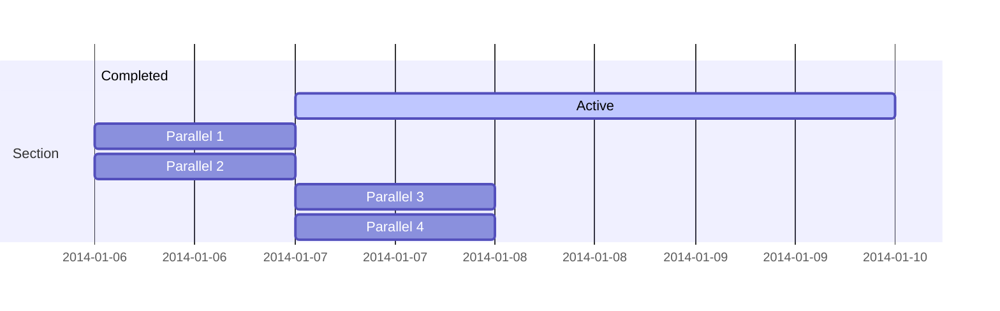

Der [Cyber Resilience Act (CRA)](https://digital-strategy.ec.europa.eu/en/policies/cyber-resilience-act) geht für viele Hersteller von vernetzten Produkten mit strengen Verpflichtungen bezüglich der IT Sicherheit einher und verlangt von diesen erhöhten Aufwand in der Dokumentation.

## Ist mein Produkt betroffen?
Der Cyber Resilience Act (CRA) richtet sich an Hersteller von Produkten mit digitalen Elementen, die in der Europäischen Union in Verkehr gebracht werden.

Betroffen sind digitale Produkte – also Produkte mit Hardware- und/oder Softwarekomponenten – die über eine Kommunikationsschnittstelle (ob per Stecker, Kabel oder kabellos) mit der Außenwelt verbunden sind. Ausgenommen sind medizinische Produkte sowie Produkte für den motorisierten Personentransport, da diese unter separate, eigenständige Regulierungen fallen. Beispiele für Produkte, die unter den neuen CRA fallen, sind:

- Smart-Home-Produkte
- Smart TVs
- Spielzeug mit Sprachaufnahme und -verarbeitung
- Ferngesteuerte Spielzeuge
- Smarte Hygieneprodukte
- Smarte Audiosysteme
- Industriesteuerungen
- Automatisierungsgeräte (z. B. Roboterarme)

## Was passiert bei Nicht-Erfüllung des Cyber Resilience Acts (CRA)? Wie hoch können die Strafen ausfallen?

Die Nichteinhaltung des Cyber Resilience Acts (CRA) kann für Unternehmen schwerwiegende rechtliche und finanzielle Konsequenzen haben. Hier sind die möglichen Folgen und Strafen, die bei einer Nicht-Erfüllung des CRA drohen:

### **Bußgelder**

Die Verordnung sieht erhebliche Geldstrafen für Verstöße vor. Die Höhe der Bußgelder richtet sich nach der Schwere des Verstoßes:

**Schwere Verstöße**: Bei schwerwiegenden Verstößen gegen die zentralen Bestimmungen des CRA, wie z.B. die Missachtung grundlegender Sicherheitsanforderungen oder das Inverkehrbringen von Produkten mit digitalen Elementen ohne angemessene Sicherheitsvorkehrungen, können Bußgelder von bis zu **15 Millionen Euro** oder **2,5 % des weltweiten Jahresumsatzes** des Unternehmens verhängt werden, je nachdem, welcher Betrag höher ist.

**Geringfügigere Verstöße**: Für weniger schwerwiegende Verstöße, wie z.B. das Nichtvorhandensein der erforderlichen technischen Dokumentation oder die nicht ordnungsgemäße Durchführung von Konformitätsbewertungen, können Bußgelder von bis zu **10 Millionen Euro** oder **2 % des weltweiten Jahresumsatzes** verhängt werden, je nachdem, welcher Betrag höher ist.

### **Vertriebsverbot und Produktrückrufe**

**Vertriebsverbot**: Produkte, die nicht den Anforderungen des CRA entsprechen, dürfen nicht in Verkehr gebracht werden. Sollte ein Produkt, das den CRA-Anforderungen nicht entspricht, bereits auf dem Markt sein, kann ein Vertriebsverbot verhängt werden.
  
**Produktrückrufe**: Behörden können anordnen, dass nicht-konforme Produkte zurückgerufen oder vom Markt genommen werden müssen, wenn diese Produkte ein erhebliches Sicherheitsrisiko darstellen.

### **Schadenersatzforderungen**

Unternehmen, die den CRA nicht erfüllen, können zudem mit Schadenersatzforderungen von Nutzern oder anderen betroffenen Parteien konfrontiert werden. Diese Ansprüche könnten sich aus Sicherheitsvorfällen ergeben, die auf eine Nichteinhaltung der Verordnung zurückzuführen sind.

### **Reputationsschaden**

Neben den finanziellen Strafen kann die Nichteinhaltung des CRA zu erheblichen Reputationsschäden führen. Dies kann langfristig negative Auswirkungen auf das Vertrauen der Kunden und Partner sowie die Marktposition des Unternehmens haben.

---

Die Nichteinhaltung des Cyber Resilience Acts kann zu sehr hohen Bußgeldern, Vertriebsverboten, Produktrückrufen und möglichen Schadenersatzforderungen führen. Unternehmen sollten daher sicherstellen, dass ihre Produkte mit digitalen Elementen den Anforderungen des CRA entsprechen, um rechtliche und finanzielle Risiken zu vermeiden. Da die Regulierungen Fachwissen in der IT-Sicherheit voraussetzen und die Maßnahmen je nach Produkt sehr umfangreich sein können, empfehlen wir Ihnen, sich schon jetzt mit dem CRA auseinanderzusetzen und die erforderlichen Maßnahmen und Dokumente umzusetzen. [Falls Sie Hilfe benötigen, unterstützen wir Sie gerne.](mailto:securisk-dk@gmail.com).

 


## Wann tritt der Cyber Resilience Act in Kraft?

Hersteller haben jetzt, nach der Verabschiedung, 36 Monate Zeit, um die vorgeschriebenen Maßnahmen umzusetzen. Da es sich um Verpflichtungen über den gesamten Produktlebenszyklus handelt und IT-Sicherheit bereits in der Entwicklungsphase berücksichtigt werden muss, sollten Hersteller frühzeitig beginnen, diese Maßnahmen in ihre Prozesse und Produkte zu integrieren.

## Was sind meine Pflichten?

Der CRA verpflichtet Hersteller, Cybersicherheit während des gesamten Produktlebenszyklus zu berücksichtigen. Die spezifischen Pflichten unterscheiden sich je nach Kategorisierung des Produkts. Hierbei gibt es folgende Hauptkategorien:

### Produkte mit digitalen Elementen

Grundsätzlich müssen für Produkte mit digitalen Elementen die im Anhang I, Kapitel 1 definierten Maßnahmen umgesetzt werden. Im Folgenden geben wir einen kurzen Überblick über die wichtigsten Maßnahmen.

#### Sicherheitsanforderungen

**Security by Design:** Produkte mit digitalen Elementen müssen so konzipiert, entwickelt und hergestellt werden, dass sie angesichts der Risiken ein angemessenes Sicherheitsniveau gewährleisten.

**Keine bekannten Schwachstellen:** Produkte mit digitalen Elementen dürfen keine bekannten, ausnutzbaren Schwachstellen enthalten.

**Risikobewertung als Teil der Dokumentation:** Auf Grundlage einer Risikobewertung müssen Risiken bezüglich der Schutzziele (Vertraulichkeit, Integrität und Authentizität) minimiert werden, um Sicherheit und Privatsphäre angemessen zu schützen. Konkrete Vorgaben wie *Datenminimierung*, *Monitoring* und *einfache Updatefähigkeit* müssen von den Herstellern berücksichtigt und umgesetzt werden. Diese Risikobewertung muss der technischen Dokumentation beigefügt werden.

Wir unterstützen Sie gerne bei der Umsetzung der Sicherheitsanforderungen.  
[Kontaktieren Sie uns einfach und unverbindlich.](mailto:securisk-dk@gmail.com)

#### Anforderungen an die Behandlung von Schwachstellen

Der CRA verpflichtet Hersteller zu einer umfassenden Behandlung identifizierter Schwachstellen:

**Erkennung und Dokumentation:** Hersteller müssen Schwachstellen und Produktkomponenten identifizieren und dokumentieren, einschließlich einer Software-Stückliste.

**Schnelle Behebung:** Schwachstellen müssen unverzüglich behoben werden, zum Beispiel durch Sicherheitsupdates.

**Regelmäßige Überprüfung:** Die Sicherheit des Produkts muss regelmäßig getestet und überprüft werden.

**Veröffentlichung von Informationen:** Nach einem Update müssen Informationen über die behobenen Schwachstellen veröffentlicht werden.

**Koordinierte Offenlegung:** Es muss eine Strategie zur koordinierten Offenlegung von Schwachstellen existieren.

**Sicherer Update-Mechanismus:** Updates müssen sicher verbreitet werden, um Schwachstellen zeitnah zu beheben.

**Kostenlose Bereitstellung von Sicherheits-Patches:** Sicherheits-Patches müssen unverzüglich und kostenlos bereitgestellt werden.


### Kritische Produkte mit digitalen Elementen

Der CRA definiert eine spezielle Unterkategorie für *kritische* Produkte mit digitalen Elementen. Im Anhang III des CRA sind Kernfunktionalitäten aufgeführt, die solche Produkte charakterisieren. Produkte, die diese Funktionalitäten erfüllen, unterliegen strengeren Anforderungen. Klasse II wird dabei noch intensiver geprüft als Klasse I, da diese Produkte ein höheres Sicherheitsrisiko darstellen.

#### Klasse I

Zu Klasse I gehören Produkte, die eine wesentliche Rolle in der Cybersicherheit spielen, jedoch nicht zu den höchstkritischen Systemen zählen. Beispiele für solche Produkte sind:

- Software für Identitätsmanagement und Verwaltung privilegierter Zugriffsrechte
- Passwort-Manager
- Firewalls und Angriffserkennungssysteme, die nicht zur Klasse II gehören
- Betriebssysteme, die nicht zur Klasse II gehören
- Router und Modems für die Internetanbindung, die nicht zur Klasse II gehören
- Mikroprozessoren, die nicht zur Klasse II gehören

#### Klasse II

Produkte der Klasse II werden in besonders kritischen Infrastrukturen eingesetzt oder haben eine sehr hohe Sicherheitsrelevanz. Beispiele hierfür sind:

- Betriebssysteme für Server, Desktops und mobile Geräte
- Firewalls und Angriffserkennungssysteme für den industriellen Einsatz
- Hardware-Sicherheitsmodule (HSM)
- Sichere Kryptoprozessoren
- Industrielle Automatisierungs- und Steuerungssysteme für wesentliche Einrichtungen

*Kritische* Produkte mit digitalen Elementen (sowohl Klasse I als auch Klasse II) unterliegen grundsätzlich einer strengeren Konformitätsprüfung. Diese umfasst eine intensivere Bewertung der Einhaltung des CRA.

## Wie wird mein Produkt überprüft?

Das Konformitätsbewertungsverfahren im Rahmen des Cyber Resilience Acts hängt von der Art und Klassifizierung des Produkts ab. Hier ein Überblick, wie das Verfahren für die drei Kategorien grundsätzlich abläuft:

### Produkte mit digitalen Elementen

Für Produkte, die nicht als kritisch eingestuft sind, wird in der Regel ein einfacheres Konformitätsbewertungsverfahren angewendet. Die entsprechenden Module sind in Anhang IV des CRA definiert:

**Interne Kontrolle (Modul A):**  
Der Hersteller trägt selbst die Verantwortung dafür, dass die grundlegenden Sicherheitsanforderungen eingehalten werden. Er erstellt die technische Dokumentation, führt interne Tests durch und bringt die CE-Kennzeichnung an. Eine externe Prüfung durch eine benannte Stelle ist nicht erforderlich, es sei denn, der Hersteller entscheidet sich freiwillig dafür.

### Kritische Produkte mit digitalen Elementen der Klasse I

Für kritische Produkte der Klasse I gelten strengere Vorschriften:

**Interne Kontrolle (Modul A):**  
Ähnlich wie bei allgemeinen Produkten kann der Hersteller die Einhaltung der Anforderungen selbst überprüfen und dokumentieren. Zusätzlich zu Modul A kann eine EU-Baumusterprüfung (Modul B) durch eine benannte Stelle erfolgen, wenn dies als notwendig erachtet wird. Es wird jedoch erwartet, dass das Produkt eine gründliche Risikobewertung durchläuft und die Konformität mit den relevanten Sicherheitsstandards streng überwacht wird.

**Konformität mit dem Baumuster (Modul C):**  
Nach erfolgreicher EU-Baumusterprüfung muss der Hersteller sicherstellen, dass alle produzierten Einheiten dem geprüften Baumuster entsprechen.

### Kritische Produkte mit digitalen Elementen der Klasse II

Kritische Produkte der Klasse II unterliegen den strengsten Anforderungen:

**EU-Baumusterprüfung (Modul B):**  
Eine benannte Stelle prüft die technische Dokumentation, bewertet die Risiken und führt Tests durch, um sicherzustellen, dass das Produkt die Anforderungen erfüllt. Nach bestandener Prüfung wird eine EU-Baumusterprüfbescheinigung ausgestellt.

**Konformität mit dem Baumuster (Modul C):**  
Der Hersteller muss nachweisen, dass alle produzierten Einheiten dem geprüften Baumuster entsprechen und dies durch entsprechende Dokumentation belegen.

**Umfassende Qualitätssicherung (Modul H):**  
Für besonders kritische Produkte kann es erforderlich sein, ein umfassendes Qualitätssicherungssystem zu implementieren. Dieses wird von einer benannten Stelle geprüft und muss den gesamten Lebenszyklus des Produkts abdecken – von der Konzeption über die Entwicklung und Herstellung bis hin zum Schwachstellenmanagement.


<!-- Hugo Blox supports a Markdown extension for mindmaps.

Simply insert a Markdown code block labelled as `markmap` and optionally set the height of the mindmap as shown in the example below.

Mindmaps can be created by simply writing the items as a Markdown list within the `markmap` code block, indenting each item to create as many sub-levels as you need:

<div class="highlight">
<pre class="chroma">
<code>
```markmap {height="200px"}
- Hugo Modules
  - Hugo Blox
  - blox-plugins-netlify
  - blox-plugins-netlify-cms
  - blox-plugins-reveal
```
</code>
</pre>
</div>

renders as

```markmap {height="200px"}
- Hugo Modules
  - Hugo Blox
  - blox-plugins-netlify
  - blox-plugins-netlify-cms
  - blox-plugins-reveal
```

## Diagrams

Hugo Blox supports the _Mermaid_ Markdown extension for diagrams.

An example **Gantt diagram**:

    ```mermaid
    gantt
    section Section
    Completed :done,    des1, 2014-01-06,2014-01-08
    Active        :active,  des2, 2014-01-07, 3d
    Parallel 1   :         des3, after des1, 1d
    Parallel 2   :         des4, after des1, 1d
    Parallel 3   :         des5, after des3, 1d
    Parallel 4   :         des6, after des4, 1d
    ```

renders as



## Todo lists

You can even write your todo lists in Markdown too:

```markdown
- [x] Write math example
  - [x] Write diagram example
- [ ] Do something else
```

renders as

- [x] Write math example
  - [x] Write diagram example
- [ ] Do something else

## Did you find this page helpful? Consider sharing it 🙌 -->
