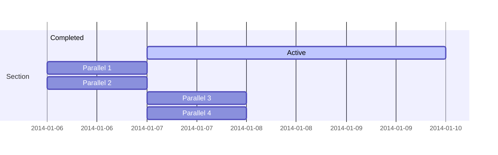

Der [Cyber Resilience Act (CRA)](https://digital-strategy.ec.europa.eu/en/policies/cyber-resilience-act) wurde bereits vom EU Parlement verabschiedet und wird nach formeller Verabschiedung im EU Rat höchstwarscheinlich in den nächsten Wochen in Kraft treten. Der CRA geht für viele Hersteller von vernetzten Produkten mit strengen Verpflichtungen bezüglich der IT Sicherheit einher und verlangt von diesen erhöhten Aufwand in der Dokumentation.

## Ist mein Produkt betroffen?

Betroffen sind digitale Produkte -- sprich Produkte mit Hardware und/oder Software Komponenten -- welche grundsätzlich eine Kommunikationsschnittstelle (mit Steckverbindung, Kabel oder kabellos) nach Außen haben. Medizinische Produkte, genauso Produkte zum motorisierten Personentransport sind ausgeschlossen, weil diese unter seperaten, eigenständigen Regularien stehen. Beispiele für Produkte, welche unter den neuen CRA fallen, sind: 

- Smart Home Produkte 
- Spielzeug mit Stimmaufnahme und Verarbeitung
- Industriesteuerung
- Automatisierungsgeräte (z.B. Roboterarme)
 


## Wann tritt der Cyber Resiliance Act in Kraft?

Dass der CRA demnächste in Kraft tritt, ist sicher. Wann dies der Fall sein wird, ist noch nicht abschließend geklärt. Momentan geht man davon aus, dass der EU Rat den CRA in den nächsten Wochen final verabschieden wird und er dann in Kraft tritt.

Hersteller haben nach Inkrafttreten 36 Monate Zeit, um die vorgeschriebenen Maßnahmen umzusetzen. Da es sich um Verpflichtungen während des kompletten Produktzyklus handelt und IT-Sicherheit schon während der Entwicklung mit einbezogen werden muss, sollten Herrsteller jedoch baldig beginnen, die Maßnahmen in ihre Prozesse und Produkte zu integrieren. 


## Was sind meine Pflichten?

Der CRA nimmt Hersteller in die Pflicht, Cyber Security während des gesamten Produktzyklus zu betrachten. Die spezifischen Pflichten unterscheiden sich je nach Kategorisierung des Produktes. Hierbei gibt es folgene Hauptkategorisierung:

### Produkte mit digitalen Elementen

Grundlegend müssen für Produkte mit digitalen Elementen die im Anhang I Kapitel 1 definierten Maßnahmen umgesetzt werden:

#### Sicherheitsanforderungen

1. Produkte mit digitalen Elementen werden so konzipiert, entwickelt und hergestellt, dass sie angesichts der Risiken ein angemessenes Cybersicherheitsniveau gewährleisten.

2. Produkte mit digitalen Elementen werden ohne bekannte ausnutzbare Schwachstellen ausgeliefert.

3. Auf der Grundlage einer Risikobewertung muss das Risiko bezüglich der Schutziele (Vertraulichkeit, Integrität und Authentizität) minimiert werden, um Sicherheit und Privatsphäre angemessen zu schützen. Hierzu werden konkrete Vorgaben gemacht, wie *Minimalisierung der Datenmengen*, *Monitoring*, und *Einfache Updatebarkeit*. Diese müssen von Herstellern bestrachtet und umgesetzt werden. Diese Risikobewertung muss insbesondere der technischen Dokumentation beigefügt werden.

#### Anforderungen an die Behandlung von Schwachstellen


### Kritische Produkte mit digitalen Elementen 
Im Anhang III der CRA sind Kernfunktionalitäten aufgelistet. Produkte, welche diese Funktionalitäten beinhalten gehen mit intensiveren Pflichten einher - wobei Klasse II nochmal umfangreicher gehandhabt werden muss als Klasse I. Dies geht einfach mit einem erhöhten Sicherheitsrisiko dieser Proudukte einher.

- Konformitätsassessment in Artikel 24 (2) and (3).
#### Klasse I


 

#### Klasse II


### 


## Was passiert bei Nichterfüllung?

<!-- Hugo Blox supports a Markdown extension for mindmaps.

Simply insert a Markdown code block labelled as `markmap` and optionally set the height of the mindmap as shown in the example below.

Mindmaps can be created by simply writing the items as a Markdown list within the `markmap` code block, indenting each item to create as many sub-levels as you need:

<div class="highlight">
<pre class="chroma">
<code>
```markmap {height="200px"}
- Hugo Modules
  - Hugo Blox
  - blox-plugins-netlify
  - blox-plugins-netlify-cms
  - blox-plugins-reveal
```
</code>
</pre>
</div>

renders as

```markmap {height="200px"}
- Hugo Modules
  - Hugo Blox
  - blox-plugins-netlify
  - blox-plugins-netlify-cms
  - blox-plugins-reveal
```

## Diagrams

Hugo Blox supports the _Mermaid_ Markdown extension for diagrams.

An example **Gantt diagram**:

    ```mermaid
    gantt
    section Section
    Completed :done,    des1, 2014-01-06,2014-01-08
    Active        :active,  des2, 2014-01-07, 3d
    Parallel 1   :         des3, after des1, 1d
    Parallel 2   :         des4, after des1, 1d
    Parallel 3   :         des5, after des3, 1d
    Parallel 4   :         des6, after des4, 1d
    ```

renders as



## Todo lists

You can even write your todo lists in Markdown too:

```markdown
- [x] Write math example
  - [x] Write diagram example
- [ ] Do something else
```

renders as

- [x] Write math example
  - [x] Write diagram example
- [ ] Do something else

## Did you find this page helpful? Consider sharing it 🙌 -->
